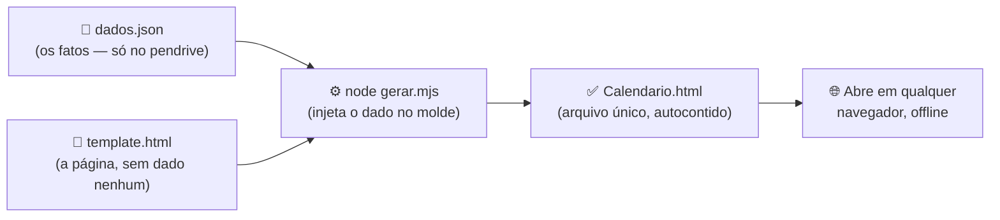

# 📅 Calendário

> **Contador de dias e organizador de medicamentos** — uma página HTML única, 100% offline, que vive num pendrive e nunca envelhece.


Sem framework. Sem servidor. Sem banco de dados. Sem `node_modules`. Um arquivo `.html`
autocontido que abre com dois cliques em qualquer máquina — Windows ou Linux — e mostra:

- ⏱️ **Contadores de dias** desde eventos importantes (com marcos de progresso: 7, 30, 90, 365 dias…)
- 💊 **O que tomar hoje**, agrupado por momento do dia (manhã · tarde · jantar · noite)
- 🔜 **Próximas mudanças** de dose ou término de tratamento
- 📜 **Histórico** em linha do tempo do que já aconteceu
- ⚠️ **Pendências** — o que ficou sem confirmar vira aviso amarelo (a página **nunca inventa** um dado que não foi dito)

A página **se recalcula a partir da data do dia** toda vez que abre. Por isso não fica
desatualizada: os contadores sobem sozinhos e as trocas de dose entram em vigor na data
certa, sem ninguém tocar em nada.

---

## 🎛️ Duas versões da contagem

O projeto mantém **duas leituras do mesmo dado**, em branches paralelos. Tudo o mais
(medicamentos, histórico, pendências, formato do `dados.json`) é idêntico — muda só o
bloco de **Contagem**:

| Branch | Contagem | Quando serve |
|---|---|---|
| **`main`** (esta) | *Stat tiles*: o número de dias como herói, com um medidor rumo ao próximo marco | Leitura de relance — "quantos dias?" e "quanto falta pro próximo marco?" |
| **[`barras`](https://github.com/LucasCerattoRS/Calend/tree/barras)** | Bloco escuro com quatro barras (dias · horas · minutos · segundos), cada uma preenchendo a fração da sua unidade e correndo a cada segundo | Sensação de tempo passando — o desenho muda ao longo do dia |

Trocar de versão é trocar de branch e regerar: `git switch barras && node gerar.mjs`.
O `dados.json` não muda, então a troca é reversível a qualquer momento.

---

## 🧭 Filosofia

Este projeto otimiza para um contexto que a maioria das ferramentas web ignora:
**uma pessoa, dado sensível de saúde, um pendrive, e a obrigação de continuar
funcionando daqui a 10 anos sem manutenção.**

| Princípio | Na prática |
|---|---|
| **Código × dado separados** | O código é versionado e público; o `dados.json` real vive **só no pendrive** e nunca entra no git (`.gitignore`). |
| **Fonte única da verdade** | O `dados.json` é o oficial; o `Calendario.html` é derivado — pode ser apagado e regerado à vontade. |
| **Zero dependência** | Roda com Node puro. Nada pra instalar, nada que possa quebrar com o tempo ou virar vulnerabilidade sem patch. |
| **Offline-first de verdade** | Não é PWA com cache: é um arquivo local. Ou o navegador abre, ou não — não existe "servidor fora do ar". |
| **Estado derivado do tempo** | Guarda-se a **data de início**, nunca "dias decorridos". O valor se recalcula sozinho e jamais desatualiza. |
| **Fail-soft** | Dado torto degrada com aviso ou silêncio controlado — documentado caso a caso em [`CASOS-LIMITE.md`](docs/estudo/CASOS-LIMITE.md). |

Cada "por que **não** usar X?" (React, localStorage, servidor, TypeScript, lib de datas,
PWA) tem uma resposta formal em [`DECISOES.md`](docs/estudo/DECISOES.md), no estilo ADR.

---

## ⚙️ Como funciona



Dois momentos, bem separados:

1. **Build (raro):** `node gerar.mjs` injeta o JSON no marcador `/*DADOS*/…/*FIM*/` do
   template e escreve o `Calendario.html`. Só precisa rodar quando **mudar** um remédio,
   dose ou evento.
2. **Abertura (todo dia):** o JavaScript embutido lê `new Date()` e redesenha as seis
   regiões da página a partir do dado + data atual. **View = f(estado)** — sem framework.

O `gerar.mjs` encontra o pendrive sozinho (sondando os pontos de montagem) e escreve a
página em dois lugares — no pendrive e na cópia local — sem nunca tocar no `dados.json`.

---

## 🚀 Comece em 1 minuto

Requisitos: [Node.js](https://nodejs.org) 18+ e mais nada.

```bash
git clone https://github.com/LucasCerattoRS/Calend.git
cd Calend

# Gera uma página de demonstração com os dados de exemplo (inventados):
node gerar.mjs dados.exemplo.json demo.html

# Abra demo.html no navegador. Pronto — isso é o app inteiro.
```

Para usar de verdade: copie `dados.exemplo.json` para `dados.json` **fora do
repositório** (ex.: `<pendrive>/Calendario/dados.json`), preencha com seus fatos e rode
`node gerar.mjs`. O `./sync-pendrive.sh` (Linux) leva o código junto pro pendrive, pra
regenerar em qualquer máquina.

---

## 📋 O formato do dado

O `dados.exemplo.json` é a documentação viva do formato — dados inventados, comentados no
próprio arquivo:

```json
{
  "eventos": [
    { "nome": "Sobriedade", "inicio": "2000-01-01T00:00", "cor": "verde" }
  ],
  "medicamentos": [
    {
      "nome": "Remédio de exemplo",
      "apresentacao": "10mg",
      "periodos": [
        { "de": "2000-01-01", "ate": null, "dose": "1 comprimido", "momento": "manhã" }
      ]
    }
  ],
  "confirmar": [
    "cada item aqui vira um aviso amarelo na página"
  ]
}
```

| Campo | O que é |
|---|---|
| `eventos[].inicio` | Data-hora de início do contador. A página mostra dias corridos, semanas e o próximo **marco** (7, 30, 90, 365 dias…). |
| `eventos[].cor` | `verde`, `ciano` ou `rosa` — identifica visualmente o contador. |
| `medicamentos[].periodos` | **É o período que manda.** "O que tomo hoje" = filtrar quem tem `de ≤ hoje ≤ ate`. `ate: null` = em aberto. |
| — desmame | Mesmo remédio, dois períodos com doses diferentes. A troca aparece em "Próximas" antes e no "Histórico" depois — automaticamente. |
| `confirmar` | O que ficou em aberto (dose não dita, término indefinido). Vira aviso amarelo — **a página nunca inventa valores**. |

---

## 📚 Material de estudo — o diferencial deste repositório

Além do app, o repositório carrega em [`docs/estudo/`](docs/estudo/) uma **documentação
didática completa do código-fonte**, escrita para quem está aprendendo programação e quer
entender cada linha — não só usar.

### Como o material é organizado

Cada arquivo de código tem **dois espelhos**, para dois momentos de estudo:

- **`*.explicado.md`** — leitura profunda, bloco a bloco de código, sempre na mesma
  estrutura: 📌 O quê · ⚙️ Como · 🎯 Porquê · 🔤 Sintaxe · 🧠 Conceito · 🔀 Alternativas ·
  ⚠️ Armadilhas.
- **`*.resumo.md`** — folha de consulta enxuta, pra revisar depois.

### O mapa completo

| Arquivo | O que entrega |
|---|---|
| [`ROTEIRO.md`](docs/estudo/ROTEIRO.md) | **Comece aqui.** Ordem de leitura que segue o fluxo do dado, com colunas de progresso pra marcar. |
| [`00-ARQUITETURA.md`](docs/estudo/00-ARQUITETURA.md) | O mapa geral: estrutura, ponto de entrada, os dois tempos de execução. |
| `*.explicado.md` / `*.resumo.md` | Espelhos didáticos de cada arquivo: dado, build (`gerar.mjs`), HTML, CSS, JS e o script de sync. |
| [`CONCEITOS.md`](docs/estudo/CONCEITOS.md) | ~50 verbetes do zero: de _truthy/falsy_ a CSS Grid, cada um apontando onde aparece no projeto. |
| [`GLOSSARIO.md`](docs/estudo/GLOSSARIO.md) · [`FLUXOGRAMA.md`](docs/estudo/FLUXOGRAMA.md) | Vocabulário e fluxos em diagrama. |
| [`DECISOES.md`](docs/estudo/DECISOES.md) | 6 ADRs: por que **não** framework, localStorage, servidor, schema, lib de datas, PWA — com trade-offs e "reconsiderar se". |
| [`CASOS-LIMITE.md`](docs/estudo/CASOS-LIMITE.md) | O que acontece com dado vazio, torto ou fora da convenção — **cada caso verificado de verdade**, com o JSON usado e a saída real capturada. |
| [`LABORATORIO.md`](docs/estudo/LABORATORIO.md) | 9 experimentos guiados de mão na massa (quebre o JSON de propósito, simule um desmame, emule tema escuro…) + tour de DevTools. |
| [`EXERCICIOS.md`](docs/estudo/EXERCICIOS.md) | 40 exercícios do básico ao avançado, com gabarito verificado — inclusive os casos em que a resposta surpreende. |
| [`harness-runtime.mjs`](docs/estudo/harness-runtime.mjs) | Ferramenta que roda o `<script>` real da página em Node (via `vm` + DOM falso) — foi como os gabaritos e casos-limite foram **provados**, não supostos. |
| [`codigo-comentado/`](docs/estudo/codigo-comentado/) | Cópias dos fontes com comentários `[ESTUDO]` linha a linha; os originais ficam limpos. |

> 💡 Mesmo que você nunca use o app, este material serve como estudo de caso de
> **JavaScript sem framework, manipulação de datas, templating, CSS moderno com design
> tokens, Node.js e Bash** — num código pequeno o bastante pra caber inteiro na cabeça.

---

## 🗂️ Estrutura do repositório

```
Calend/
├── template.html          # A página: HTML + CSS + JS embutidos, zero dado
├── gerar.mjs              # O build: injeta dados.json no template → Calendario.html
├── sync-pendrive.sh       # Leva o código pro pendrive (Linux; nunca toca no dado)
├── dados.exemplo.json     # O formato, documentado com dados inventados
├── .gitignore             # A política: dados.json e Calendario.html NUNCA entram
└── docs/estudo/           # Documentação didática completa (ver tabela acima)
```

---

## 🔒 Privacidade por construção

O dado real (`dados.json`) e a página gerada com ele (`Calendario.html`) são **bloqueados
pelo `.gitignore`** — a separação código × dado não é disciplina, é regra mecânica do
repositório. Tudo que está versionado aqui usa exclusivamente os **dados inventados** do
`dados.exemplo.json`.

---

## 📄 Licença

**© 2026 LuKas — todos os direitos reservados**, com uso liberado nos termos da
[**CC BY-NC-SA 4.0**](https://creativecommons.org/licenses/by-nc-sa/4.0/deed.pt-br)
(Atribuição · Não Comercial · Compartilha Igual):

- ✅ Pode usar, estudar, adaptar e redistribuir — **com crédito ao autor**.
- 🚫 **Não** pode usar comercialmente.
- 🔁 Derivados devem circular sob **esta mesma licença**.

Detalhes em [`LICENSE.md`](LICENSE.md).

> ⚕️ **Aviso:** isto é uma ferramenta pessoal de organização, não um dispositivo médico.
> Não substitui orientação profissional de saúde.
