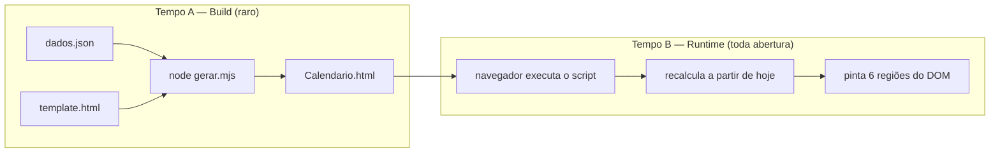
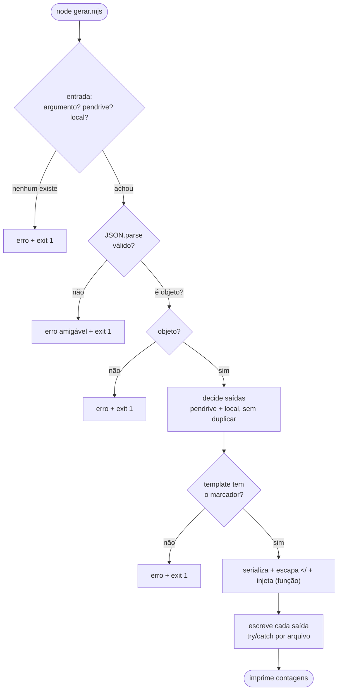
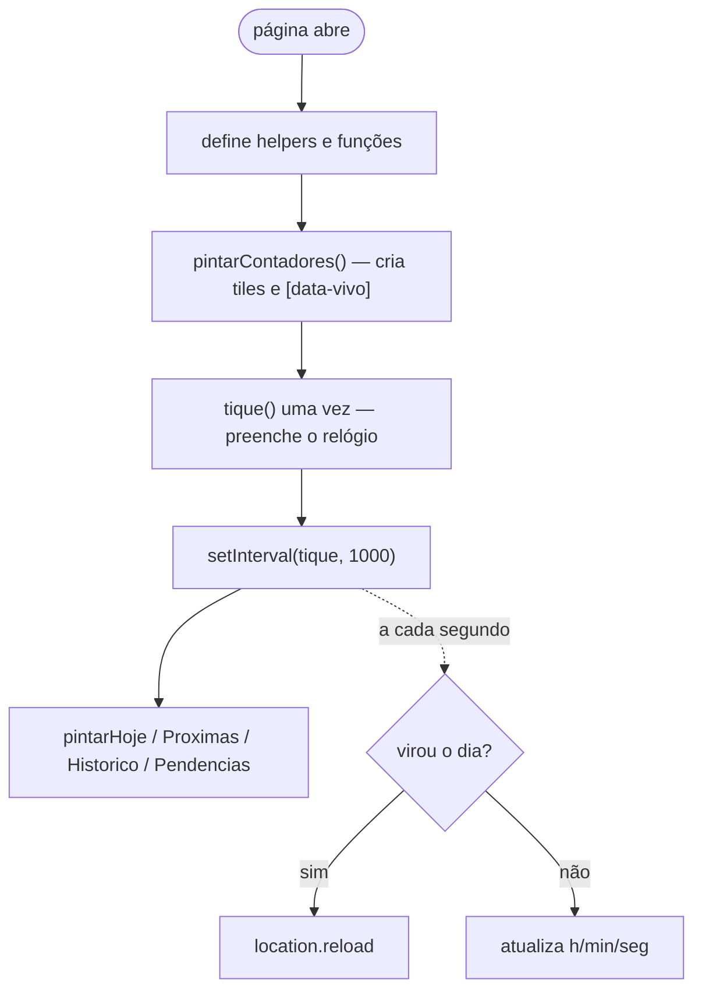
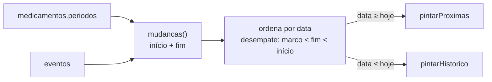
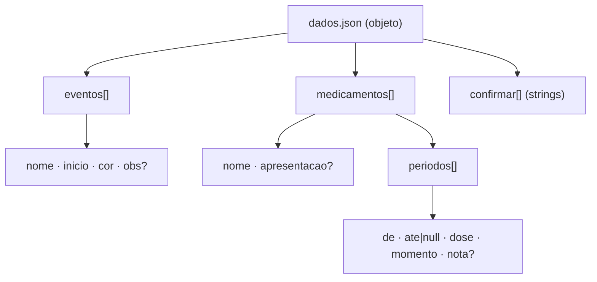
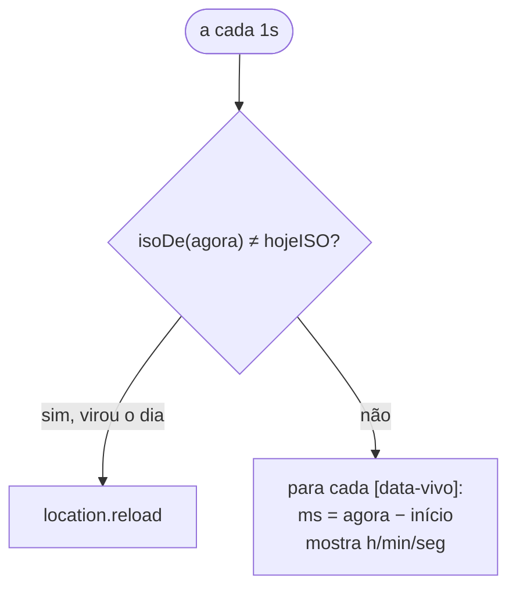

# 🔀 Fluxogramas

Os principais fluxos do projeto, em [Mermaid](https://mermaid.js.org) (renderiza no
GitHub, VS Code com extensão, e muitos leitores de Markdown) **e** em texto, pra ler em
qualquer lugar.

---

## 1. Visão geral — os dois tempos

**Em texto:** `dados.json` + `template.html` → `gerar.mjs` → `Calendario.html`; abrir no
navegador → script lê `DADOS` + data de hoje → pinta a página.

---

## 2. Build — o que o `gerar.mjs` faz

**Em texto:** achar dado → validar (existe? é JSON? é objeto?) → planejar saídas → conferir
marcador → injetar com segurança → escrever tolerando falha → relatar.

---

## 3. Runtime — a partida da página

**Ordem que importa:** `pintarContadores` **antes** de `tique` (o relógio precisa dos
elementos `[data-vivo]`).

---

## 4. O motor comum: uma linha do tempo, dois filtros

**Em texto:** `mudancas()` achata períodos e eventos numa lista única ordenada; "Próximas"
e "Histórico" são só **filtros** dela (por isso hoje aparece nas duas).

---

## 5. Modelo de dados

**Em texto:** um objeto com 3 listas; medicamento tem **períodos** (intervalos `[de, ate]`
com dose/momento) — o conceito central do formato.

---

## 6. `tique()` — o laço do relógio

**Em texto:** se o dia virou, recarrega (a página se renova sozinha); senão, atualiza os
relógios ao vivo.
